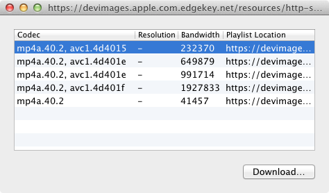
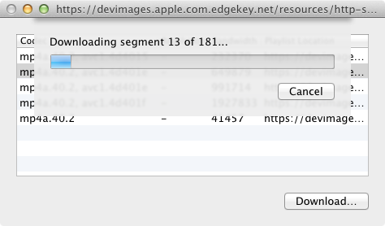

### HLS Downloader

#### Purpose
Downloads HTTP Live Streaming segments to a single file.

#### Overview

[HTTP Live Streaming](http://en.wikipedia.org/wiki/HTTP_Live_Streaming) (HLS) is an Apple developed technology to stream video over HTTP.

With HLS a selection of different streams to chose from are usually provided so you can select one that works best for any device or connection data-rate limitations.

These streams are then segmented into separate files or byte-range sections (HLS Downloader doesn't support byte-range playlists atm.) to allow videoplayers an easy way to navigate to different sections in the stream.

HLS Downloader will let you chose one of these streams and then download all the segments for it into a single file for offline viewing.

The usual format for HLS content is H.264 video, AAC-audio in an MPEG2-transport stream.

HLS Downloader just concatenates segments so what you will get is a joined MPEG2-transport stream.

You can strip the MPEG2-transport information by running the saved file through ffmpeg:
```ffmpeg -i joined.ts -vcodec copy -acodec copy joined.mp4```

#### Requirements & Limitations
Developed as part of Hackday at [UIKonf 2013](http://www.uikonf.com), this is untested alpha software...

* 10.7+
* Extended M3U "parsing" is currently terribly naive.
* No support byte-range playlists.
* No support for resuming a download.


#### Screenshots




#### License
[MIT](http://opensource.org/licenses/MIT)